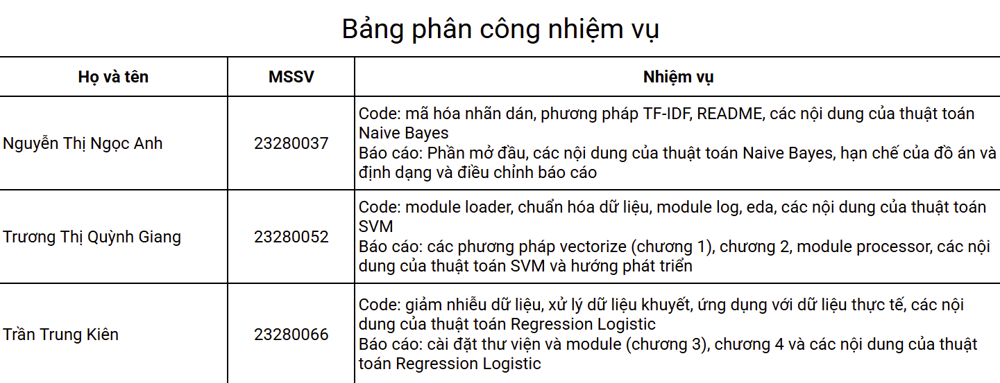

# Emotion Classification

## Mục tiêu đồ án: 
Xây dựng hệ thống phân loại cảm xúc tiếng Việt từ dữ liệu gắn nhãn, sử dụng các mô hình Machine Learning kết hợp quy trình xử lý ngôn ngữ tự nhiên (NLP).

Phân loại cảm xúc thành 3 nhóm chính:
- Tích cực
- Tiêu cực
- Trung tính

**Pipeline:** EDA -> Data Loading -> Data Preprocessing -> Feature Engineering -> Modeling -> Evaluation -> Visualization

**Cấu trúc thư mục**:
``` bash
Emo-Classification/
│
├── README.md                       # Mô tả tổng quan, cách cài đặt, chạy, dataset, mô hình...
├── requirements.txt                # Thư viện cần thiết
├── config.py                       # Cấu hình chung: thông số, paths, constants
│
├── data/                           # Dữ liệu chính của project         
│
├── src/                            # Mã nguồn chính
│   ├── processor_layer/            # Module tiền xử lý dữ liệu
│   │     ├──__init__.py
│   │     ├──loader.py              # Load dữ liệu
│   │     └──processor.py           # Tiền xử lý dữ liệu  
│   │   
│   ├── feature_layer/              # Module trích xuất đặc trưng 
│   │    ├── __init__.py
│   │    ├── base.py
│   │    └── tfidf.py               # Phương pháp TF-IDF
│   │
│   ├── model_layer/                # Định nghĩa mô hình, huấn luyện, đánh giá
│   │    ├──__init__.py
│   │    ├── base.py
│   │    ├── svm.py                 # Mô hình Support Vector Machine
│   │    ├── naive.py               # Mô hình Naive Bayes
│   │    └── logistics.py           # Mô hình Regression Logistic
│   │    
│   ├── optimize_layer/             # Module tìm tham số tối ưu cho mô hình 
│   │    ├──__init__.py
│   │    ├── base.py 
│   │    ├── svm_optimize.py        # tham số tối ưu cho mô hình SVM
│   │    ├── naive_optimize.py      # tham số tối ưu cho mô hình Naive
│   │    └── logistic_optimize.py   # tham số tối ưu cho mô hình Logistic
│   │
│   ├── visualiztion_layer/         # Module trực quan dữ liệu (kết quả)
│   │    ├──__init__.py
│   │    ├── base.py
│   │    ├── svm.py                 # Trực quan Support Vector Machine
│   │    ├── naive.py               # Trực quan Naive Bayes
│   │    └── logistics.py           # Trực quan Regression Logistic
│   │
│   └── models_saver                # Lưu mô hình
│
├── EDA.ipynb                       # Notebook khám phá dữ liệu               
│               
├── logs/                           # File log, output log
│
├── images/                         # báo cáo, biểu đồ, thống kê.
│                 
├── app.py                          # Unit tests
│ 
├── main.py                         # file chạy chương trình chính
│
└── .gitignore                      # Loại trừ file không cần track (data lớn, log, v.v)
```
## Cài đặt 
### Clone repository
```bash
git clone https://github.com/nannh2582005/Emo-Classification.git
cd Emo-Classification
```
### Tải mã nguồn thủ công 
Truy cập https://github.com/nannh2582005/Emo-Classification.git

Chọn **Download ZIP** -> giải nén để sử dụng
### Cài đặt thư viện
``` bash
pip install -r requirements.txt
```

## Pipeline xử lý dữ liệu 
### 1. Data Loader:
- Đọc dữ liệu: hỗ trợ các file đuôi .csv, .xlsx, .xls, .\
- Trả về dữ liệu về kiểu pandas.DataFrame
### 2. Data Processor 
Bao gồm các bước:
- chuẩn hóa về unicode
- chuyển về chữ thường 
- loại bỏ URL và các ký hiệu đặc biệt (!\"#$%\'()*+,....)
- loại bỏ khoảng trắng thừa
- chuẩn hóa các ký tự lặp ('huhuuuuuu' -> 'huhu')
- tokenization bằng ViTokenizer
- loại bỏ stopwords
- gộp nhãn dữ liệu (Enjoyment, Surprise -> Tích cực,...)
- chuẩn hóa teencode (dùng teencode_dict.json)
- chuẩn hóa emoji (dùng emoji_dict.json)
- mã hóa nhãn thành số

Tất cả được gọi trong hàm preprocess.preprocess()
### 3. Data Feature
Dùng phương pháp TFIDF để đưa dữ liệu về dạng vector để làm đầu vào cho mô hình học máy, fit + transform danh sách token đã được xử lý\
Input: danh sách token đã xử lý\
Output: ma trận TF-IDF dạng sparse, phù hợp cho mô hình học máy
Các tham số quan trọng:
- ngram_range
- max_features
- min_df, max_df
- sublinear_tf
### 4. Data Model
Huấn luyện các mô hình học máy:
- SVM
- LinearRegression
- Naive Bayes
### 5. Hyperparameter Optimization
Để cải thiện mô hình, nhóm sử dụng Grid Search và Cross-validation
### 6. Evaluation
Hiệu suất mô hình được đánh giá bằng các chỉ số:
- Accuracy
- Precision
- Recall
- F1-score
- Confusion Matrix

Các báo cáo được sinh tự động bằng classification_report của scikit-learn.
### 7. Visualization 
Trực quan dữ liệu bằng ma trận nhầm lẫn
## Chạy chương trình

## Danh sách thành viên
|STT|Họ và tên              |MSSV    |
|---|-----------------------|--------|
|1  |Nguyễn Thị Ngọc Anh    |23280037|
|2  |Trương Thị Quỳnh Giang |23280052|
|3  |Trần Trung Kiên        |23280066|
## Bảng phân công 
